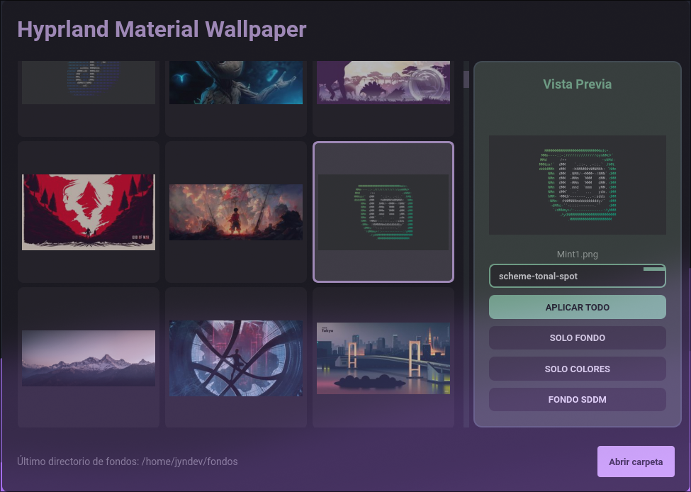

# 🌌 Hyprland Material Wallpaper Manager

> Una herramienta premium para gestionar tus fondos de pantalla en Hyprland con estilo Material Design y sincronización automática de colores.

---

## 📸 Previsualización



---

## 🚀 Características principales

- ✅ **Diseño Material You**: Interfaz moderna basada en PySide6 y Material Design.
- 🎨 **Algoritmo Matugen**: Generación automática de paletas de colores basadas en el fondo seleccionado.
- ⚡ **Optimización AGS**: Reinicio inteligente de widgets de AGS para aplicar temas sin parpadeos.
- 🖼️ **Motor awww**: Cambios de fondo ultra-rápidos con transiciones fluidas.
- 📦 **Standalone**: Posibilidad de compilar en un solo archivo ejecutable.

---

## 🛠️ Instalación y Configuración

### 1. Dependencias del Sistema (Arch Linux)
Asegúrate de tener instaladas las herramientas necesarias en tu sistema:
```bash
sudo pacman -S python python-pip awww matugen-bin gsettings-desktop-schemas
```

### 2. Preparación del Entorno
Se recomienda usar un entorno virtual para evitar conflictos:
```bash
# Clonar el proyecto
git clone https://github.com/Jyndev/FondosApp.git
cd FondosApp

# Crear y activar el entorno
python -m venv env
source env/bin/activate

# Instalar librerías de Python
pip install -r requirements.txt
```

### 3. Ejecución directa
Para probar la aplicación rápidamente:
```bash
python main.py
```

---

## 🏗️ Compilación (Un solo archivo)

Si deseas generar un ejecutable final que no dependa de tener instalado Python o las librerías, hemos configurado el proyecto para compilarse en un **único archivo ejecutable**.

### Requisitos de compilación:
```bash
pip install pyinstaller
```

### Comando de compilación:
```bash
pyinstaller FondosApp.spec --noconfirm
```

Al terminar, encontrarás el binario listo para usar en:
📂 `dist/FondosApp`

---

## ⚙️ Integración con AGS
Esta aplicación está diseñada para trabajar en conjunto con **Aylur's GTK Shell (AGS)**. Al cambiar un fondo, la app:
1. Detecta los colores predominantes.
2. Actualiza los tokens de color del sistema mediante `matugen`.
3. Reinicia los widgets de AGS en la ruta `~/.config/ags/yuu/app.ts` (configurable en `wallpaper_service.py`).

---

## 🤝 Contribuciones
¡Las contribuciones son bienvenidas! Siéntete libre de abrir un issue o enviar un pull request.

---

## 📄 Licencia
Este proyecto está bajo la Licencia MIT.

---
*Desarrollado con ❤️ para la comunidad de Hyprland.*
